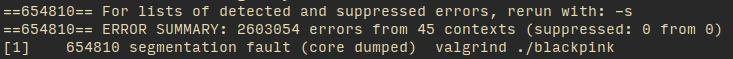
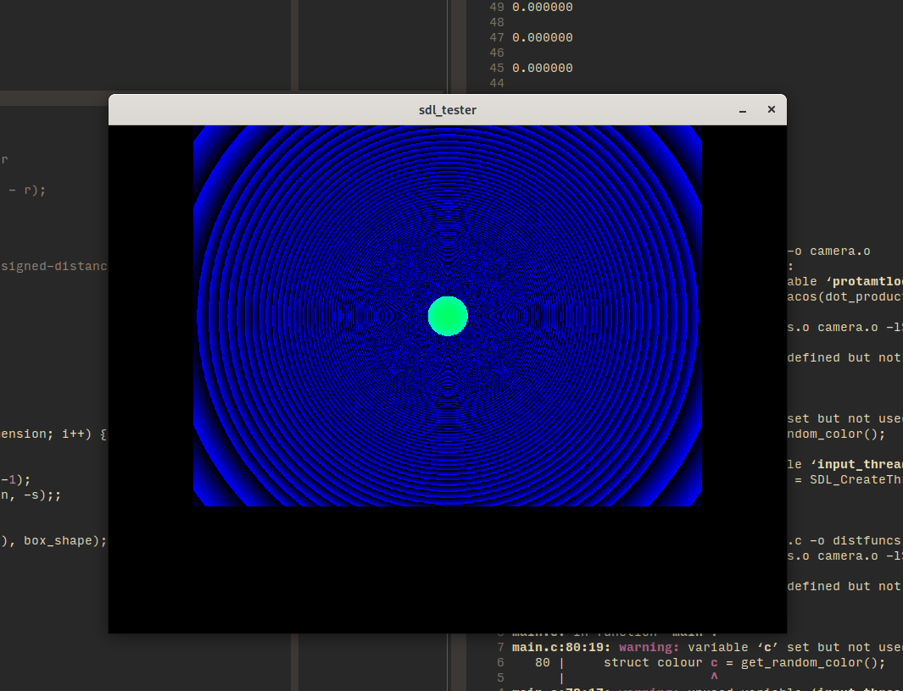
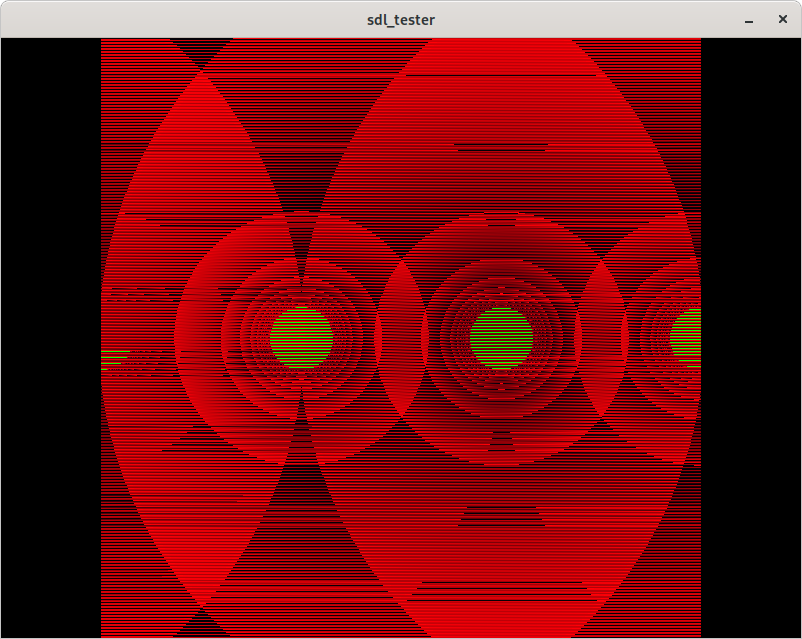

# Objective

Can we use raymarching to render primitive objects inside an arbitrary manifold
in real time?

"Non-euclidean rendering" in the most generalised form possible.

---

# Raymarching

- an approximate and fast form of 'raytracing'
- good for primitives (spheres, boxes et cetera.)
- still very expensive

---

# Manifolds

Only one of us does galaxy brain maths.

---

# Tech Stack Requirements

- Fast, compiled code
- We are relatively familiar with it (that disqualifies any _modern_ or "good"
    language, and C++)
- Need n-dimensional vectors
- Need to draw pixels on a window
- not Java

---

# C and libSDL2

Its fast (to run) and we "know" it. C is a nice language if only for the 
simplicity of its mental model. 

libSDL2 is what the big kids like Valve use.

- nicely handles threading, drawing, timers, and gets out of the way. 

---

Richal spent 10 hours writing a vector library from scratch.

N-dimentional determinants and cross products _sound_ simple. 

---

At one point we were leaking memory at approximately 150Mb per second.



---

The first success was 1pm on saturday, where we got a circle drawn to the
screen. 



---

Fail states were often interesting. 



---

# Results

video? image? demo?

---


# Takeaways 1

- sticking raymarching vectors to manifolds in 4 dimensions is possible but has 
    a lot of edge cases 

---

# Takeaways 2 

- having RAII would be really nice when writing a vector library 

```c
    if (1 || keyboardstate[SDL_SCANCODE_UP]) {
        struct ray cameraray = {.pos = copy_vec(camera->pos), .dir = camera->y};
        manifoldturn(&cameraray, camera->x, 0);
        free_vec(cameraray.pos);

        cameraray.pos = copy_vec(camera->pos);
        manifoldturn(&cameraray, camera->y, 0);
        free_vec(cameraray.pos);

        cameraray.pos = camera->pos;
        manifoldstep(&cameraray, dist);
        free_vec(cameraray.pos);
    }
```

